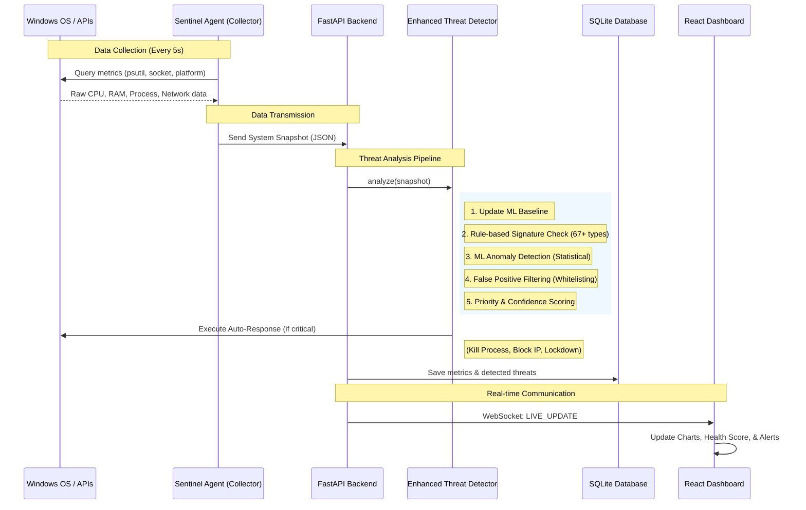

# 🛡️ SENTINEL - Complete System Architecture

## 🌟 Overview

SENTINEL is an **AI-Powered Endpoint Threat Detection and Auto-Response System** designed for Windows environments. It provides 24/7 monitoring, real-time analytics, and automated mitigation of over 67 types of cyber threats.

---

## 🔄 End-to-End Data Flow

This diagram illustrates how data flows through the system, from raw hardware metrics to the final user dashboard and automated response.



---

## 🏗️ Core Components

### **1. 🕵️ Sentinel Agent (The Collector)**
- **Role**: The "Eyes" of the system.
- **Location**: `agent/collector.py`
- **Modules**:
  - `SystemCollector`: Hardware stats (CPU, RAM, Disk, Battery).
  - `ProcessCollector`: Every running process with behavioral risk scoring.
  - `NetworkCollector`: Active connections, traffic volume, and suspicious ports.
  - `SecurityCollector`: USB devices, startup items, and open ports.

### **2. 🧠 Enhanced Threat Detector (The Brain)**
- **Role**: Decision making and mitigation.
- **Location**: `ml_engine/enhanced_detector.py`
- **Key Features**:
  - **Rule Engine**: 67+ hardcoded signatures for known attacks (Ransomware, Trojans, etc.).
  - **ML Anomaly Detector**: Learns "Normal" system behavior and alerts on deviations.
  - **False Positive Filter**: Multi-layer whitelisting to prevent annoying false alarms.
  - **Auto-Response Engine**: Programmatic execution of safety measures (Shutting down, Isolating).

### **3. ⚡ FastAPI Backend (The Nerve Center)**
- **Role**: Orchestration and API layer.
- **Location**: `backend/server.py`
- **Features**:
  - **REST API**: For historical data and manual threat resolution.
  - **WebSockets**: For sub-second data streaming to the frontend.
  - **State Management**: Tracks recent metrics and auto-response logs.

### **4. 📊 React Dashboard (The Interface)**
- **Role**: Human-readable visualization.
- **Location**: `frontend/src/App.jsx`
- **Features**:
  - **Real-time Charts**: CPU/RAM/Network timelines.
  - **Threat Management**: Detailed breakdown of active attacks.
  - **Health Score**: A proprietary 0-100 score of PC security.
  - **Quarantine Hub**: Manage isolated files and rollback actions.

---

## 🛠️ Technology Stack

### **Backend & Core (Python 3.11+)**
| Technology | Usage |
| :--- | :--- |
| **FastAPI** | High-performance REST & WebSocket API |
| **psutil** | System & process monitoring |
| **scikit-learn** | ML Anomaly detection & baseline modeling |
| **SQLAlchemy** | Database ORM for SQLite |
| **Uvicorn** | ASGI server implementation |

### **Frontend (Modern JS)**
| Technology | Usage |
| :--- | :--- |
| **React 18** | UI component architecture |
| **Recharts** | Real-time data visualization |
| **Lucide React** | Premium iconography |
| **WebSocket API** | Real-time bi-directional streaming |

### **Storage**
| Technology | Usage |
| :--- | :--- |
| **SQLite** | Local, zero-configuration persistent storage |

---

## 📁 Project Structure

```text
THREAT DETECTOR/
├── agent/                # System data collection logic
├── ml_engine/            # AI & Signature detection engines
├── backend/              # FastAPI server & route handlers
├── frontend/             # React source code & dashboard
├── database/             # SQLite schema & DB manager
├── quarantine/           # Isolated malicious files
├── sentinel.db           # Persistent data storage
└── requirements.txt      # Python dependencies
```

---

## 🎓 Design Philosophy

1. **Local-First**: No data leaves your PC. Everything is processed locally for maximum privacy.
2. **Proactive Mitigation**: Unlike standard AV which just alerts, SENTINEL *acts* to stop damage.
3. **Zero-Configuration**: Built to run out of the box with intelligent defaults.
4. **Developer Friendly**: Structured code with clear separation of concerns.

---

**🛡️ SENTINEL v2.2 - Complete System Architecture**
*"Detect. Respond. Protect."*
